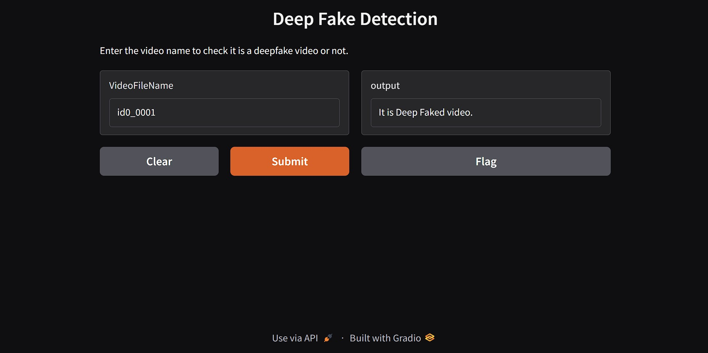

# DeepFake Detection



DeepFake Detection is a computer vision project that focuses on face extraction, recognition model training, and face prediction in both images and videos.

## Notebooks Overview

### 1. Face Image Extraction (`FaceImageExtraction.ipynb`)
- Extracts faces from images
- Preprocesses facial data for training
- Creates datasets from image collections
- Outputs cropped/aligned face images

### 2. Model Training & Evaluation (`ModelTrainandEval.ipynb`)
- Implements face recognition model architecture
- Trains models using extracted face datasets
- Evaluates model performance metrics
- Contains validation and testing workflows
- Includes model saving functionality

### 3. Prediction (`Predection.ipynb`)
- Loads trained models for inference
- Performs face recognition on new images
- Generates predictions with confidence scores
- Visualizes recognition results

### 4. Video Processing (`VideoProcessing.ipynb`)
- Processes video files frame-by-frame
- Applies face detection on video streams
- Implements real-time recognition
- Outputs annotated video with recognition results

## Getting Started

1. Clone the repository:
```bash
git clone https://github.com/MLNexusHub/DeepFake_Detection.git
```

2. Run Jupyter notebooks in this order:
```
1. FaceImageExtraction.ipynb
2. ModelTrainandEval.ipynb
3. Predection.ipynb (for images)
4. VideoProcessing.ipynb (for videos)
```

## Project Structure
```
DeepFake_Detection/
├── FaceImageExtraction.ipynb
├── ModelTrainandEval.ipynb
├── Predection.ipynb
├── VideoProcessing.ipynb
├── 1_scrrenshot.jpg
├── .gitignore
├── LICENSE
└── README.md
```

## Requirements
- Python 3.7+
- OpenCV
- TensorFlow/Keras
- dlib
- face_recognition
- Jupyter Notebook
- Other dependencies specified in notebooks

## License
This project is licensed under the terms of the MIT License - see [LICENSE](LICENSE) file for details.

## Contribution
Contributions are welcome! Please open an issue or submit a pull request for any improvements.
